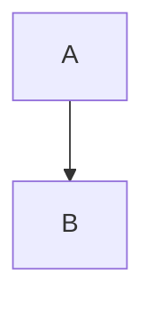

# Astro Starter Kit: Basics

```sh
npm create astro@latest -- --template basics
```

[](https://stackblitz.com/github/withastro/astro/tree/latest/examples/basics)
[](https://codesandbox.io/p/sandbox/github/withastro/astro/tree/latest/examples/basics)
[](https://codespaces.new/withastro/astro?devcontainer_path=.devcontainer/basics/devcontainer.json)

> 🧑‍🚀 **Seasoned astronaut?** Delete this file. Have fun!


## 🚀 Project Structure

Inside of your Astro project, you'll see the following folders and files:

```text
/
├── public/
│   └── favicon.svg
├── src/
│   ├── layouts/
│   │   └── Layout.astro
│   └── pages/
│       └── index.astro
└── package.json
```

To learn more about the folder structure of an Astro project, refer to [our guide on project structure](https://docs.astro.build/en/basics/project-structure/).

## 🧞 Commands

All commands are run from the root of the project, from a terminal:

| Command                   | Action                                           |
| :------------------------ | :----------------------------------------------- |
| `npm install`             | Installs dependencies                            |
| `npm run dev`             | Starts local dev server at `localhost:4321`      |
| `npm run build`           | Build your production site to `./dist/`          |
| `npm run preview`         | Preview your build locally, before deploying     |
| `npm run astro ...`       | Run CLI commands like `astro add`, `astro check` |
| `npm run astro -- --help` | Get help using the Astro CLI                     |

## 👀 Want to learn more?

Feel free to check [our documentation](https://docs.astro.build) or jump into our [Discord server](https://astro.build/chat).

# Personal Website

My personal website built with Astro and TailwindCSS.

## 🚀 Getting Started

```bash
# Install dependencies
npm install

# Start development server
npm run dev

# Build for production
npm run build

# Preview production build
npm run preview
```

## 📝 Writing Blog Posts

### Creating a New Post

1. Create a new Markdown file in `src/content/blog/` with the format `your-post-slug.md`
2. Add the required frontmatter at the top of your file:

```yaml
---
title: "Your Blog Post Title"
description: "A brief description of your post"
pubDate: 2024-03-14
category: "Your Category"  # Optional
coverImage: "/blog-assets/your-image.jpg"  # Optional
attachments:  # Optional
  - file: "your-file.pdf"
    name: "Display Name"  # Optional
---
```

### Markdown Features

The blog supports a rich set of Markdown features for creating beautiful and interactive content:

#### Basic Formatting
- **Bold**: `**bold text**`
- *Italic*: `*italic text*`
- ***Bold and Italic***: `***bold and italic text***`
- ~~Strikethrough~~: `~~strikethrough text~~`
- [Links](https://example.com): `[link text](url)`

#### Lists
- Unordered lists (use `-` or `*`)
- Ordered lists (use `1.`, `2.`, etc.)
- Task lists:
  ```markdown
  - [x] Completed task
  - [ ] Pending task
  ```

#### Code
- Inline code: \`code\`
- Code blocks with syntax highlighting:
  ````markdown
  ```javascript
  function example() {
    return "Hello, World!";
  }
  ```
  ````

#### Blockquotes
```markdown
> Single line quote
>
> Multi-paragraph
>> Nested quote
```

#### Tables
```markdown
| Header 1 | Header 2 |
|----------|----------|
| Cell 1   | Cell 2   |
```

#### Admonitions
```markdown
::: note
Note content
:::

::: tip
Tip content
:::

::: warning
Warning content
:::

::: danger
Danger content
:::
```

#### Collapsible Sections
```markdown
<details>
<summary>Click to expand</summary>

Content here
</details>
```

#### Math Equations
- Inline math: `$E = mc^2$`
- Display math:
  ```markdown
  $$
  \frac{d}{dx}e^x = e^x
  $$
  ```

#### Keyboard Shortcuts
```markdown
Press <kbd>Cmd</kbd> + <kbd>S</kbd>
```

#### Definition Lists
```markdown
Term
: Definition
: Another definition
```

#### Diagrams
The blog supports Mermaid diagrams:
````markdown

````

#### Images
```markdown

```

### Example Post
For a complete example showcasing all available features, check out the `markdown-showcase.md` file in the blog content directory.

## 🔧 Development

```bash
# Create a new blog post
touch src/content/blog/your-post-slug.md

# Start development server to preview
npm run dev
```

## 📚 Resources

- [Markdown Guide](https://www.markdownguide.org/)
- [LaTeX Math Symbols](https://oeis.org/wiki/List_of_LaTeX_mathematical_symbols)
- [Mermaid Diagram Syntax](https://mermaid.js.org/)
- [Astro Documentation](https://docs.astro.build)
