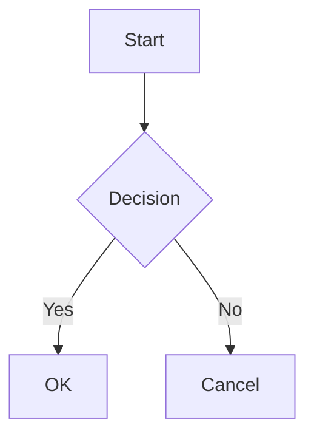

# Markdown Styling Guide

This post demonstrates all available styling features for your blog posts. Use this as a reference when writing your own content.

## Basic Typography

Regular paragraph text looks like this. You can make text **bold**, *italic*, or ***bold and italic***. You can also add ~~strikethrough~~ text.

### Links and References

You can create [inline links](https://example.com) or reference-style links[^1].

## Lists

### Unordered Lists
- First item
- Second item
  - Nested item
  - Another nested item
- Third item

### Ordered Lists
1. First step
2. Second step
   1. Nested step
   2. Another nested step
3. Third step

### Task Lists
- [x] Completed task
- [ ] Pending task
- [ ] Future task

## Code Blocks

Inline code: `const greeting = "Hello, World!";`

Code block with syntax highlighting:
```javascript
function calculateSum(a, b) {
  return a + b;
}

// Call the function
const result = calculateSum(5, 3);
console.log(result); // 8
```

## Blockquotes

> This is a blockquote. It can contain multiple paragraphs.
>
> Second paragraph in the blockquote.
>> Nested blockquotes are also possible.

## Tables

| Feature | Description | Status |
|---------|-------------|--------|
| Tables | Organized data display | ✅ |
| Code Blocks | Syntax highlighting | ✅ |
| Math | LaTeX support | ✅ |

## Admonitions

::: note
This is a note admonition. Use it for general information.
:::

::: tip
This is a tip admonition. Use it for helpful tips and tricks.
:::

::: warning
This is a warning admonition. Use it for important warnings.
:::

::: danger
This is a danger admonition. Use it for critical information.
:::

## Collapsible Sections

<details>
<summary>Click to expand</summary>

This content is hidden by default and can be expanded by clicking.

- You can include any Markdown content here
- Lists, code blocks, etc.
</details>

## Math Equations

Inline math: $E = mc^2$

Display math:
$$
\frac{d}{dx}e^x = e^x
$$

## Keyboard Shortcuts

Press <kbd>Cmd</kbd> + <kbd>S</kbd> to save on macOS.

## Definition Lists

Term 1
: Definition of term 1
: Additional definition

Term 2
: Definition of term 2

## Diagrams with Mermaid



## Images


## Horizontal Rule

Above the line

---

Below the line

[^1]: This is a footnote reference. 